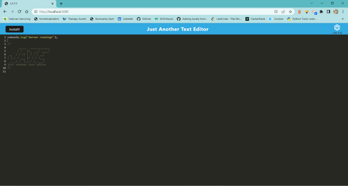
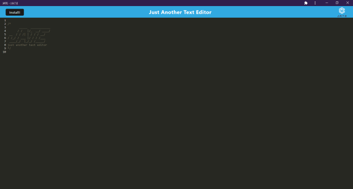

# Just Another Text Editor

## Table of Contents
  * [Description](#description)
  * [Installation](#installation)
  * [Usage](#usage)
  * [Technology](#technology)
  * [Images](#images)
  * [Questions](#questions)

## Description
A simple text editor app that can be used both online and offline. When app gets closed out or refreshed, any text will be saved and will appear when app is opened again or refreshed.

## Installation
To install needed dependencies for the app, user will need to clone the app. Then, user will need to run the command `npm install` to install all dependencies (they are all included already in package.json)

## Usage
To use the app, click [deployed app](https://vgonzalez-text-editor.herokuapp.com/) link. To use offline, user can click on "install" button on top left corner of the page.

## Technology
  * HTML/CSS
  * JavaScript
  * Webpack
  * IndexDB
  * Babel
  * Express.js
  * Workbox

## Images

## Questions
Have any questions? Please feel free to reach out!  
GitHub: https://github.com/ValPal1320  
Email: valgonzalez13@yahoo.com